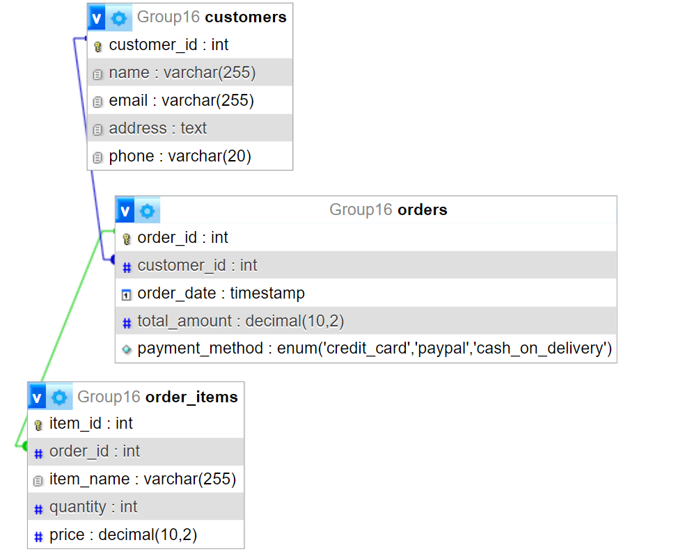

# Group16_web_project
Bagmati Restaurant - Team16

The website is for a restaurant that mixes different types of food to make something unique.

## Table of Contents

Features

### Feature 1 (Santosh Sigdel): Online ordering.

### Feature 2 (Ajit Devkota): Customer Feedback.

### Feature 3 (Nitish Raj Neupane): Contact Information.

### Feature 4 (Bibek Pandey): Online Table Reservation.

### Feature 1   
 In this feature we enable customers to place orders directly through the website. This feature includes menu browsing, customization option, and secure payment option.

### Feature 2
 This feature enables customers to share their opinions and experiences easily through a feedback form. Staff can view, respond, and act on feedback, allowing for continuous improvement and maintaining customer satisfaction.

### Feature 3
 This Feature provides  user-friendly contact form, interactive map, email options, social media links, business hours, and a responsive design, ensuring a smooth and accessible communication experience for website visitors.

### Feature 4 
This features  support easy reservation processing, greet guests, manage advanced  online bookings, easy to order. All of this ensure that customers have a smooth and pleasant dining experience.

### Database Tables

 Database Tables 

Here are the list of database table that are part of our project.

#### Table 1( created by Santosh Sigdel): OrderingTable
# santosh Sigdel (online odering)
CREATE TABLE customers (
    customer_id INT AUTO_INCREMENT PRIMARY KEY,
    name VARCHAR(255),
    email VARCHAR(255),
    address TEXT,
    phone VARCHAR(20)
);

CREATE TABLE orders (
    order_id INT AUTO_INCREMENT PRIMARY KEY,
    customer_id INT,
    order_date TIMESTAMP DEFAULT CURRENT_TIMESTAMP,
    total_amount DECIMAL(10, 2),
    payment_method ENUM('credit_card', 'paypal', 'cash_on_delivery'),
    FOREIGN KEY (customer_id) REFERENCES customers(customer_id)
);

CREATE TABLE order_items (
    item_id INT AUTO_INCREMENT PRIMARY KEY,
    order_id INT,
    item_name VARCHAR(255),
    quantity INT,
    price DECIMAL(10, 2),
    FOREIGN KEY (order_id) REFERENCES orders(order_id)
);
 

#### Table 2( created by Ajit Devkota):CustomersFeedback and Sign up
# Azeet Devkota (Customers sign up and feedback)
CREATE TABLE `Customers` (
  `customers_id` int NOT NULL,
  `first_name` varchar(50) NOT NULL,
  `last_name` varchar(50) NOT NULL,
  `email_id` varchar(50) NOT NULL,
  `password` varchar(255) NOT NULL,
  `phone` varchar(50) NOT NULL,
  `address` varchar(50) NOT NULL
) ENGINE=InnoDB DEFAULT CHARSET=utf8mb4 COLLATE=utf8mb4_0900_ai_ci;

CREATE TABLE `CustomersFeedback` (
  `feedback_id` int NOT NULL,
  `customers_id` int NOT NULL,
  `feedbackMessage` varchar(400) NOT NULL,
  `timestamp` datetime NOT NULL DEFAULT CURRENT_TIMESTAMP
) ENGINE=InnoDB DEFAULT CHARSET=utf8mb4 COLLATE=utf8mb4_0900_ai_ci;

#### Table 3( created by Nitish Raj Neupane):ContactUs
#### Table 4( created by Bibek Pandey):TableBooking

