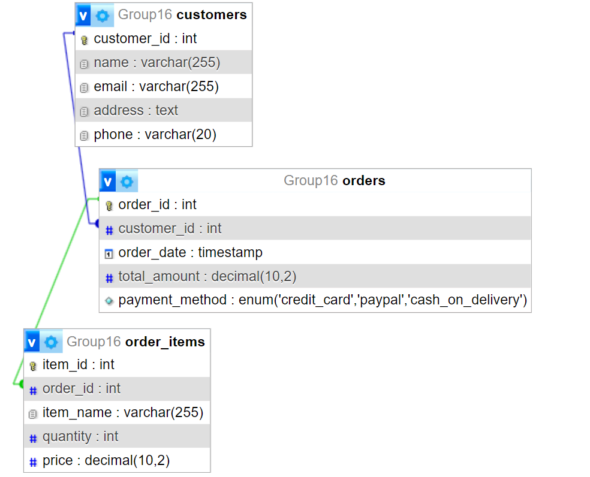

# Azeet Devkota (Customers sign up and feedback)
CREATE TABLE `Customers` (
  `customers_id` int NOT NULL,
  `first_name` varchar(50) NOT NULL,
  `last_name` varchar(50) NOT NULL,
  `email_id` varchar(50) NOT NULL,
  `password` varchar(255) NOT NULL,
  `phone` varchar(50) NOT NULL,
  `address` varchar(50) NOT NULL
) ENGINE=InnoDB DEFAULT CHARSET=utf8mb4 COLLATE=utf8mb4_0900_ai_ci;

CREATE TABLE `CustomersFeedback` (
  `feedback_id` int NOT NULL,
  `customers_id` int NOT NULL,
  `feedbackMessage` varchar(400) NOT NULL,
  `timestamp` datetime NOT NULL DEFAULT CURRENT_TIMESTAMP
) ENGINE=InnoDB DEFAULT CHARSET=utf8mb4 COLLATE=utf8mb4_0900_ai_ci;

CREATE TABLE `menu` (
  `Menu_Id` int NOT NULL,
  `food_name` varchar(100) NOT NULL,
  `Size` varchar(100) NOT NULL
) ENGINE=InnoDB DEFAULT CHARSET=utf8mb4 COLLATE=utf8mb4_0900_ai_ci;
COMMIT;
# santosh Sigdel (online odering)
CREATE TABLE customers (
    customer_id INT AUTO_INCREMENT PRIMARY KEY,
    name VARCHAR(255),
    email VARCHAR(255),
    address TEXT,
    phone VARCHAR(20)
);

CREATE TABLE orders (
    order_id INT AUTO_INCREMENT PRIMARY KEY,
    customer_id INT,
    order_date TIMESTAMP DEFAULT CURRENT_TIMESTAMP,
    total_amount DECIMAL(10, 2),
    payment_method ENUM('credit_card', 'paypal', 'cash_on_delivery'),
    FOREIGN KEY (customer_id) REFERENCES customers(customer_id)
);

CREATE TABLE order_items (
    item_id INT AUTO_INCREMENT PRIMARY KEY,
    order_id INT,
    item_name VARCHAR(255),
    quantity INT,
    price DECIMAL(10, 2),
    FOREIGN KEY (order_id) REFERENCES orders(order_id)
);
 
